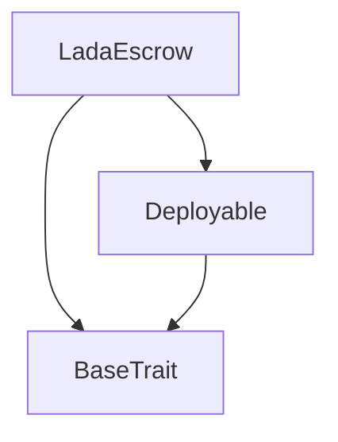
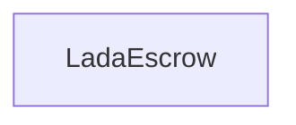

# Tact compilation report
Contract: LadaEscrow
BoC Size: 1945 bytes

## Structures (Structs and Messages)
Total structures: 25

### DataSize
TL-B: `_ cells:int257 bits:int257 refs:int257 = DataSize`
Signature: `DataSize{cells:int257,bits:int257,refs:int257}`

### SignedBundle
TL-B: `_ signature:fixed_bytes64 signedData:remainder<slice> = SignedBundle`
Signature: `SignedBundle{signature:fixed_bytes64,signedData:remainder<slice>}`

### StateInit
TL-B: `_ code:^cell data:^cell = StateInit`
Signature: `StateInit{code:^cell,data:^cell}`

### Context
TL-B: `_ bounceable:bool sender:address value:int257 raw:^slice = Context`
Signature: `Context{bounceable:bool,sender:address,value:int257,raw:^slice}`

### SendParameters
TL-B: `_ mode:int257 body:Maybe ^cell code:Maybe ^cell data:Maybe ^cell value:int257 to:address bounce:bool = SendParameters`
Signature: `SendParameters{mode:int257,body:Maybe ^cell,code:Maybe ^cell,data:Maybe ^cell,value:int257,to:address,bounce:bool}`

### MessageParameters
TL-B: `_ mode:int257 body:Maybe ^cell value:int257 to:address bounce:bool = MessageParameters`
Signature: `MessageParameters{mode:int257,body:Maybe ^cell,value:int257,to:address,bounce:bool}`

### DeployParameters
TL-B: `_ mode:int257 body:Maybe ^cell value:int257 bounce:bool init:StateInit{code:^cell,data:^cell} = DeployParameters`
Signature: `DeployParameters{mode:int257,body:Maybe ^cell,value:int257,bounce:bool,init:StateInit{code:^cell,data:^cell}}`

### StdAddress
TL-B: `_ workchain:int8 address:uint256 = StdAddress`
Signature: `StdAddress{workchain:int8,address:uint256}`

### VarAddress
TL-B: `_ workchain:int32 address:^slice = VarAddress`
Signature: `VarAddress{workchain:int32,address:^slice}`

### BasechainAddress
TL-B: `_ hash:Maybe int257 = BasechainAddress`
Signature: `BasechainAddress{hash:Maybe int257}`

### Deploy
TL-B: `deploy#946a98b6 queryId:uint64 = Deploy`
Signature: `Deploy{queryId:uint64}`

### DeployOk
TL-B: `deploy_ok#aff90f57 queryId:uint64 = DeployOk`
Signature: `DeployOk{queryId:uint64}`

### FactoryDeploy
TL-B: `factory_deploy#6d0ff13b queryId:uint64 cashback:address = FactoryDeploy`
Signature: `FactoryDeploy{queryId:uint64,cashback:address}`

### TokenNotification
TL-B: `token_notification#7362d09c queryId:uint64 amount:coins from:address forwardPayload:remainder<slice> = TokenNotification`
Signature: `TokenNotification{queryId:uint64,amount:coins,from:address,forwardPayload:remainder<slice>}`

### CreateRace
TL-B: `create_race#6c726300 raceId:uint64 stake:coins player1:address player2:address = CreateRace`
Signature: `CreateRace{raceId:uint64,stake:coins,player1:address,player2:address}`

### Payout
TL-B: `payout#6c726304 raceId:uint64 winner:address seed:uint256 = Payout`
Signature: `Payout{raceId:uint64,winner:address,seed:uint256}`

### Refund
TL-B: `refund#6c726305 raceId:uint64 = Refund`
Signature: `Refund{raceId:uint64}`

### WithdrawJettons
TL-B: `withdraw_jettons#6c726306 amount:coins to:address = WithdrawJettons`
Signature: `WithdrawJettons{amount:coins,to:address}`

### SetJettonWallet
TL-B: `set_jetton_wallet#6c726307 wallet:address = SetJettonWallet`
Signature: `SetJettonWallet{wallet:address}`

### SetPlayer2
TL-B: `set_player2#6c726308 raceId:uint64 player2:address = SetPlayer2`
Signature: `SetPlayer2{raceId:uint64,player2:address}`

### WinnerDeclared
TL-B: `winner_declared#6c7263f1 raceId:uint64 winner:address loser:address combinedSeed:uint256 pot:coins payout:coins houseFee:coins = WinnerDeclared`
Signature: `WinnerDeclared{raceId:uint64,winner:address,loser:address,combinedSeed:uint256,pot:coins,payout:coins,houseFee:coins}`

### RaceRefunded
TL-B: `race_refunded#6c7263f2 raceId:uint64 player1:address player2:address refundAmount:coins = RaceRefunded`
Signature: `RaceRefunded{raceId:uint64,player1:address,player2:address,refundAmount:coins}`

### TokenTransfer
TL-B: `token_transfer#0f8a7ea5 queryId:uint64 amount:coins destination:address responseDestination:address customPayload:Maybe ^cell forwardTonAmount:coins forwardPayload:remainder<slice> = TokenTransfer`
Signature: `TokenTransfer{queryId:uint64,amount:coins,destination:address,responseDestination:address,customPayload:Maybe ^cell,forwardTonAmount:coins,forwardPayload:remainder<slice>}`

### Race
TL-B: `_ stake:coins player1:address player2:address deposited1:bool deposited2:bool state:uint8 = Race`
Signature: `Race{stake:coins,player1:address,player2:address,deposited1:bool,deposited2:bool,state:uint8}`

### LadaEscrow$Data
TL-B: `_ owner:address houseWallet:address ladaJettonWallet:address races:dict<uint64, ^Race{stake:coins,player1:address,player2:address,deposited1:bool,deposited2:bool,state:uint8}> = LadaEscrow`
Signature: `LadaEscrow{owner:address,houseWallet:address,ladaJettonWallet:address,races:dict<uint64, ^Race{stake:coins,player1:address,player2:address,deposited1:bool,deposited2:bool,state:uint8}>}`

## Get methods
Total get methods: 4

## raceOf
Argument: raceId

## owner
No arguments

## houseWalletAddress
No arguments

## jettonWalletAddress
No arguments

## Exit codes
* 2: Stack underflow
* 3: Stack overflow
* 4: Integer overflow
* 5: Integer out of expected range
* 6: Invalid opcode
* 7: Type check error
* 8: Cell overflow
* 9: Cell underflow
* 10: Dictionary error
* 11: 'Unknown' error
* 12: Fatal error
* 13: Out of gas error
* 14: Virtualization error
* 32: Action list is invalid
* 33: Action list is too long
* 34: Action is invalid or not supported
* 35: Invalid source address in outbound message
* 36: Invalid destination address in outbound message
* 37: Not enough Toncoin
* 38: Not enough extra currencies
* 39: Outbound message does not fit into a cell after rewriting
* 40: Cannot process a message
* 41: Library reference is null
* 42: Library change action error
* 43: Exceeded maximum number of cells in the library or the maximum depth of the Merkle tree
* 50: Account state size exceeded limits
* 128: Null reference exception
* 129: Invalid serialization prefix
* 130: Invalid incoming message
* 131: Constraints error
* 132: Access denied
* 133: Contract stopped
* 134: Invalid argument
* 135: Code of a contract was not found
* 136: Invalid standard address
* 138: Not a basechain address
* 2961: Unknown race
* 3669: Only owner may create races
* 15525: Only owner may withdraw
* 16285: Winner must be a player
* 20273: Race not awaiting deposits
* 20616: Only owner may payout
* 23616: Race not in funded state
* 26626: Only owner may set jetton wallet
* 28511: Only Lada jetton wallet may notify
* 35499: Only owner
* 37861: Only owner may refund
* 42864: Player2 already deposited
* 44467: Stake must be positive
* 51833: Only owner may update player2
* 51945: Players must differ
* 57529: Race already finalized
* 59477: Race already exists

## Trait inheritance diagram

## Contract dependency diagram

